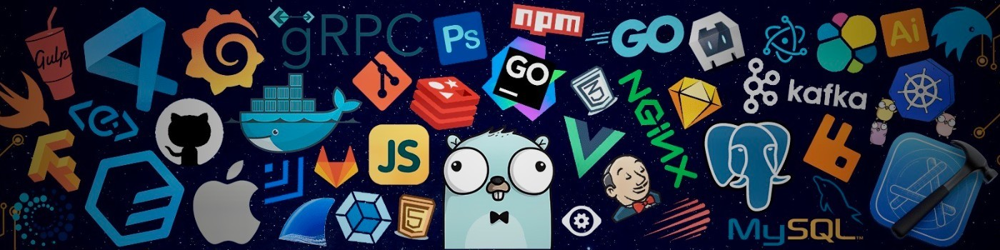

## Hi 👋, I'm Satya Ranjon Sharma

### Passionate learner and developer, always exploring new technologies and seeking opportunities to enhance my skills

---

## 📫 How to reach me **_<satyaranjonofficial@gmail.com>_**

## :eyes: Current overview

- 🔭 I’m currently working on **MERN Projects**

- 🌱 I’m currently learning **AWS**

- 💬 Ask me about **JavaScript, TypeScript, Node.js, React.js, Next.js, MongoDB, Express.js**

- 📫 How to reach me **_[https://www.linkedin.com/in/satya-ranjon-sharma/](https://www.linkedin.com/in/satya-ranjon/)_**

## :mailbox: Reach me out

## :computer: Technologies that I know

## :chart_with_upwards_trend: Current Stats

---

| GitHub Streak Stats                                                                         | GitHub Stats                                                                                                              |
| ------------------------------------------------------------------------------------------- | ------------------------------------------------------------------------------------------------------------------------- |
|  |  |

---
