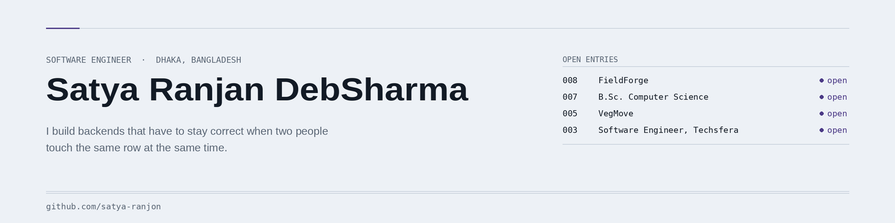
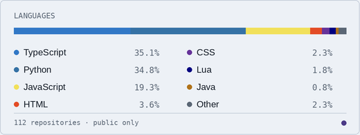

<picture>
  <source media="(prefers-color-scheme: dark)" srcset="./assets/banner-dark.png">
  
</picture>

## Satya Ranjan DebSharma

Software engineer in Dhaka, Bangladesh.

I build backends that have to stay correct when two people touch the same row at the same time — inventory
ledgers, reservation logic, reporting that has to reconcile. Most of what I find interesting lives in that
problem: idempotency, lock ordering, and invariants the database enforces rather than ones the application
merely hopes for.

Currently at Techsfera, working on VegMove.

### What I'm working on

**VegMove** — a live quick-commerce platform I ship to continuously. A NestJS backend behind a storefront
and an admin console, with Flutter apps for the customer, warehouse, packing and delivery sides. In
production and under active development, so most of my week is new features, fixes and performance work on
a system people are using right now.

`NestJS` `Prisma` `PostgreSQL` `Redis` `BullMQ` `SSE`

**FieldForge** — a field service marketplace I'm building on my own, to work through distributed system
design deliberately rather than picking it up incidentally: service boundaries, a typed event contract, a
ten-state work order machine, and the infrastructure around it. It is a scaffold at this stage — the design
and the contracts are real, the services don't run yet.

`NestJS` `Drizzle` `MySQL` `React 19` `Terraform`

**B.Sc. in Computer Science** at Uttara University, alongside full-time work. I came up through a diploma
and self-teaching, so the theory I skipped is the part I'm most interested in filling in.

### Tools I reach for

Mostly NestJS on the server, Express before that. PostgreSQL and MySQL, through Prisma or Drizzle. Redis and
BullMQ for caching and background work. Flutter for mobile.

Terraform, Kubernetes and GitHub Actions I've used on FieldForge, my own project, rather than run in
production. Worth saying plainly.

### Stats

<picture>
  <source media="(prefers-color-scheme: dark)" srcset="https://streak-stats.demolab.com?user=satya-ranjon&amp;type=png&amp;background=0F141C&amp;border=232C39&amp;stroke=232C39&amp;ring=A392E8&amp;fire=C9903A&amp;currStreakNum=E7ECF3&amp;sideNums=E7ECF3&amp;currStreakLabel=8A96A6&amp;sideLabels=8A96A6&amp;dates=8A96A6">
  
</picture>
<!-- langs:start -->
<picture>
  <source media="(prefers-color-scheme: dark)" srcset="./assets/langs-dark.png">
  
</picture>
<!-- langs:end -->

### Reach me

<satyaranjonofficial@gmail.com> · [LinkedIn](https://www.linkedin.com/in/satya-ranjon/) · [Stack Overflow](https://stackoverflow.com/users/16218908)
